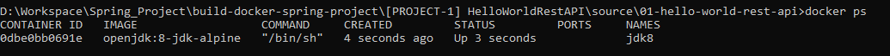
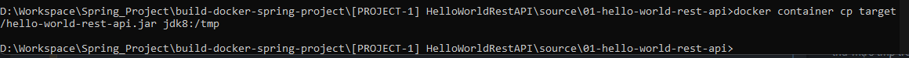

**1. Tạo một container jdk 8:**

   `docker run -dit --name jdk8 openjdk:8-jdk-alpine`

   Kiểm tra:
    

**2.Tại container jdk8, chạy lệnh ls /tmp (để truy cập vào danh sách các item trong thư mục tmp)**

`docker container exec jdk8 ls /tmp
`

**3.Copy file jar trong folder target ở máy local vào thư mực tmp trong container**

`docker container cp target/hello-world-rest-api.jar jdk8:/tmp
`
  

	
	