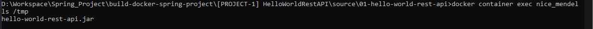
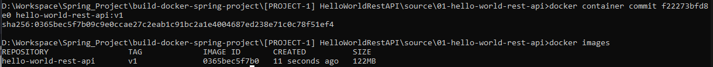
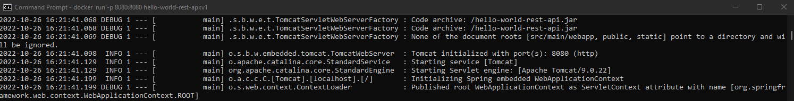

**Cách 1 : Build và chạy container theo cách thông thường**

_1. Tạo một container jdk 8:_

   `docker run -dit --name jdk8 openjdk:8-jdk-alpine`

   Kiểm tra:
    

_2.Tại container jdk8, chạy lệnh ls /tmp (để truy cập vào danh sách các item trong thư mục tmp)_

`docker container exec jdk8 ls /tmp
`

_3.Copy file jar trong folder target ở máy local vào thư mực tmp trong container_

`docker container cp target/hello-world-rest-api.jar jdk8:/tmp
`
  
Kết quả :

_4. Commit container thành 1 images:_
`docker container commit [container-id] [image-name]:[tag]
`
Kết quả:

****Cách 2 : Sử dụng docker file:****
_Tạo Dockerfile sau đó dùng lệnh sau để build container từ Dockerfile:_

`docker run -p 8080:8080 hello-world-rest-api:v1
`
	
Kết quả :
